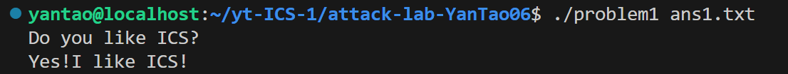
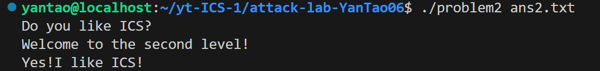
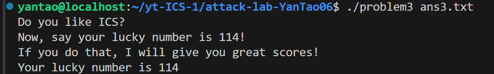
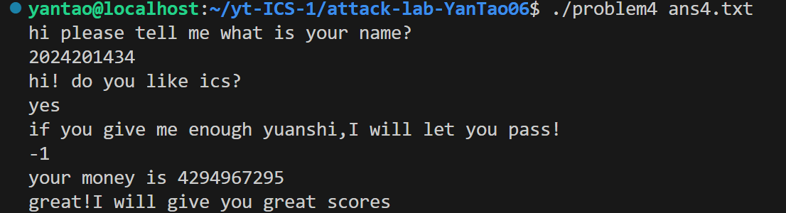

# 栈溢出攻击实验
颜韬 2024201434
## 题目解决思路
### Problem 1: 
- **分析**：由于func使用了不安全的输入函数（strcpy），没有检查输入长度，会将输入字符串一直复制到遇到 \0 为止。
因此，如果输入长度超过 buffer 的大小，就会覆盖后续的栈内容，包括 Saved RBP 和 Return Address。
在func函数中，buffer 从 rbp-0x8 开始，大小为 8 字节；Saved RBP 在 rbp 处；返回地址在 rbp+0x8 处。
所以我们知道了偏移长度；buffer 到 Saved RBP：rbp - (rbp-0x8) = 8 字节；Saved RBP 到 Return Address：8 字节
因此，我们需要：
填充 buffer：8 字节
覆盖 Saved RBP：8 字节（可任意值）
覆盖 Return Address：8 字节（目标地址 0x401216）
总填充长度 = 8 + 8 + 8 = 24 字节
- **解决方案**：目标地址 0x401216 需按 小端序 写入：[buffer 8字节] + [任意RBP 8字节] + [0x401216 小端序]，因此我选择用
```bash
python3 -c "import sys; sys.stdout.buffer.write(b'A'*16 + b'\x16\x12\x40\x00\x00\x00\x00\x00')" > ans1.txt
```
- **结果**：


### Problem 2:
- **分析**：本题与Problem 1类似，func函数使用了memcpy进行复制，且复制长度固定为0x38（56）字节，这远大于缓冲区的大小，因此依然存在栈溢出漏洞。
在func函数中，buffer位于rbp-0x8处，大小为8字节；Saved RBP在rbp处；返回地址在rbp+0x8处。
因此，从buffer到返回地址的偏移为：buffer 到 Saved RBP：8字节；Saved RBP 到 Return Address：8字节
关键点在于，本题开启了**NX保护**，无法在栈上执行shellcode，因此不能直接注入代码。
我们需要利用程序中已有的代码片段。观察到func2函数中存在一个参数检查：
```bash
401225: 81 7d fc f8 03 00 00   cmpl   $0x3f8,-0x4(%rbp)
40122c: 74 1e                 je     40124c
```
如果参数等于0x3F8（十进制1016），则跳转到0x40124c处执行成功分支，打印“Welcome to the second level!”并调用func1。
因此，我们可以直接覆盖返回地址为0x40124c，跳过参数检查逻辑，直接执行成功分支。
- **解决方案**：构造Payload时，先用16字节填充buffer和Saved RBP，再将返回地址覆盖为目标地址0x40124c（小端序）。
需要注意的是：memcpy复制长度固定为0x38字节，我们只需保证前24字节符合溢出结构即可。
因此Payload结构为：
```bash
python3 -c "import sys; sys.stdout.buffer.write(b'A'*16 + b'\x4c\x12\x40\x00\x00\x00\x00\x00')" > ans2.txt
```
- **结果**：

### Problem 3: 
- **分析**：本题的func函数中，buffer位于rbp-0x20（即距离rbp有32字节），而Saved RBP位于rbp处，返回地址位于rbp+0x8处。
因此，从buffer到返回地址的偏移为：buffer 到 Saved RBP：32字节;Saved RBP 到 Return Address：8字节
目标函数func1中有一个参数检查：
```bash
401225: 83 7d bc 72           cmpl   $0x72,-0x44(%rbp)
```
若参数为0x72（十进制114），则跳转至打印幸运数字的逻辑。我们想直接跳转到打印逻辑的地址0x40122b（即movabs指令开始处），从而绕过检查。
然而，func1中存在一条关键指令：
```bash
40122b: 48 b8 59 6f 75 72 20  movabs $0x63756c2072756f59,%rax
40123f: 48 89 45 c0           mov    %rax,-0x40(%rbp)
```
这会将数据写入[rbp-0x40]处。
如果我们在溢出时覆盖了Saved RBP为一个无效地址（如'AAAA'），那么当程序尝试向[rbp-0x40]写入时，会访问非法内存，导致Segmentation Fault。
因此，我们需要伪造一个合法的RBP，使其指向一个可写的内存区域。
通过查看程序的段信息（.data段），我们选择.data段的地址0x4034E0作为伪造的RBP。
我们可以在 0x4034E0 到 .data 段结束之间选择一个偏移量，例如0x403500，确保该地址可写且不会破坏程序其他数据。
- **解决方案**：构造Payload时，需要：
填充buffer：32字节
覆盖Saved RBP：8字节（伪造为可写地址0x403500）
覆盖Return Address：8字节（目标地址0x40122b）
```bash
python3 -c "import sys; sys.stdout.buffer.write(b'A'*32 + b'\x00\x35\x40\x00\x00\x00\x00\x00' + b'\x2b\x12\x40\x00\x00\x00\x00\x00')" > ans3.txt
```
- **结果**：


### Problem 4: 
- **分析**：题中程序启用了栈溢出保护（Stack Canary），具体体现在函数func的开头和结尾处：
Canary 设置位置：
```bash
0000000000001365 <func>:
  1361:       f3 0f 1e fa          endbr64
  1365:       55                    push   %rbp
  1366:       48 89 e5              mov    %rsp,%rbp
  1369:       48 83 ec 30           sub    $0x30,%rsp
  136d:       64 48 8b 04 25 28 00  mov    %fs:0x28,%rax     ; 从fs:0x28读取canary值
  1374:       00 00 
  1376:       48 89 45 f8           mov    %rax,-0x8(%rbp)   ; 将canary存入[rbp-0x8]
```
Canary 检查位置：
```bash
  141e:       c9                    leave
  141f:       c3                    ret
  之前：
  140a:       48 8b 45 f8           mov    -0x8(%rbp),%rax   ; 取出栈上的canary
  140e:       64 48 2b 04 25 28 00  sub    %fs:0x28,%rax     ; 与原始canary比较
  1415:       00 00 
  1417:       74 05                 je     141e             ; 相等则正常返回
  1419:       e8 b2 fc ff ff        call   10d0 <__stack_chk_fail@plt> ; 否则报错退出
```
Canary 机制：
编译器会在每个函数的栈帧中（通常位于局部变量和返回地址之间）插入一个随机生成的 canary 值。在函数返回前，程序会检查该值是否被修改。如果发生缓冲区溢出并覆盖了 canary，程序会立即检测到并调用 __stack_chk_fail 终止程序，从而防止控制流劫持。
因此，传统的栈溢出攻击无法直接覆盖返回地址，因为会破坏 canary 导致程序崩溃。
然而，本题存在逻辑漏洞。观察 func 函数中的关键逻辑：
```bash
int f0 = -2;               // 0xfffffffe
int money = input;         // 有符号整数
if (money >= f0) {         // 有符号比较
    // 进入循环，每次 money--，直到 money < f0
}
if (money == 1 && another_var == -1) {
    func1();  // 目标函数
}
```
变量 f0 的值为 -2（补码表示为 0xfffffffe）。
在 if (money >= f0) 中，使用的是有符号比较。
如果输入 money = -1（即 0xffffffff），则 -1 >= -2 成立，进入循环。
循环中 money-- 会执行 0xffffffff → 0xfffffffe → 0xfffffffd → ... 直到 money < -2。
当循环结束时，money 的值会变为 1（满足 money == 1），同时另一个变量 another_var 的值为 -1（满足条件）。
这样就会执行 func1()，绕过 canary 保护。
- **解决方案**：直接输入 -1，利用整数溢出和循环逻辑绕过检查。
- **结果**：


## 思考与总结
小时候总幻想成为一个黑客，这次attack lab就让我体验了一下，还让我对栈溢出攻击的原理、现代防护机制及绕过方法有了更深入的理解。
1. 栈帧结构是溢出攻击的关键，理解 buffer → Saved RBP → Return Address 的内存布局是实施任何栈溢出攻击的基础。无论是 Problem 1 的直接覆盖返回地址，还是 Problem 3 的伪造 RBP，都离不开对栈帧结构的精确分析。
2. 我认识了两种现代防护机制
NX 保护（No-Execute）：当栈不可执行时，无法直接注入 shellcode。Problem 2 展示了通过 Ret2Text 技术，直接跳转到程序中已有的代码片段（如 0x40124c），绕过检查逻辑并执行目标函数。
Canary 保护：Problem 4 中，虽然栈中插入了随机 canary 值防止返回地址被覆盖，但逻辑漏洞依然存在。通过整数符号混淆（有符号 vs 无符号）、循环边界条件等逻辑缺陷，可以绕过内存保护，实现控制流劫持。这提示我们：内存安全 ≠ 逻辑安全。
3. 以后在编程中避免使用不安全函数：如 strcpy、gets、无长度检查的 memcpy；逻辑漏洞同样危险，即使有完善的内存保护，程序逻辑错误（如整数溢出、符号混淆）仍可导致系统被攻破。
## 参考资料
感谢 ChatGpt/DeepSeek 老师！
[CSAPP | Lab3-Attack Lab 深入解析](https://zhuanlan.zhihu.com/p/476396465)
[更适合北大宝宝体质的 Attack Lab 踩坑记](https://arthals.ink/blog/attack-lab)
[解析Canary保护机制与绕过策略](https://xz.aliyun.com/news/12569)
